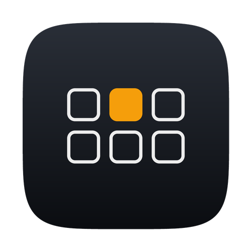

<div align="center">



# Quiet Keys

**Your keyboard, but better.**

A native macOS menu bar app that plays realistic mechanical keyboard switch sounds on every keystroke and mouse click — ultra-low latency, spatial audio, 22 switch profiles, fully offline. Part of the [Quiet Apps](https://github.com/quietapps) family.

[](https://www.apple.com/macos/)
[](https://swift.org)
[](https://developer.apple.com/xcode/swiftui/)
[](LICENSE)
[](https://github.com/quietapps/QuietKeys/releases)
[](https://github.com/quietapps/QuietKeys/releases)
[](https://github.com/quietapps/QuietKeys/stargazers)

[Install](#install) · [Features](#features) · [Usage](#usage) · [Build from source](#build-from-source) · [FAQ](#faq)

</div>

---

## Why

You love the sound of a good mechanical keyboard — but you're on a MacBook, in an office, or your partner is asleep next door.

Quiet Keys lives in your menu bar and plays a realistic switch sound for every key you press, through your speakers or headphones. Pick from 22 switch profiles across 13 brands, watch keys light up on a floating visualizer, and hear keys on the left of your keyboard from the left speaker. Everything runs on-device. No cloud. No account. No telemetry.

## Features

**Current release:** version **1.0.2**, build **3** — see [CHANGELOG](CHANGELOG.md) for per-build notes

### Sound

- **22 switch profiles** across IQUNIX, Lofree, Akko, Keychron, Aflion, Durock, Gateron, NovelKeys, Drop, Kailh, IBM, Topre, Alps — plus a quirky Lizard
- **Ultra-low latency** — lock-free audio engine, 128-frame CoreAudio buffer, all samples preloaded; nothing allocates on the audio thread
- **Spatial audio** — keys on the left half of your keyboard play from the left speaker; keys on the right play from the right
- **Distinct press and release sounds** — per-key-class samples (space, return, and backspace sound deeper), round-robin variants so no two keystrokes sound identical
- **Mouse click sounds** for left, right, and middle buttons; toggleable
- **Original samples** — every shipped sample is synthesized from parametric switch models in this repo; no recordings from other apps

### Visualizer & typing test

- **Reactive visualizer** — a floating mini keyboard that lights up keys as you press them; follow-cursor or fixed screen positions, optional key labels
- **Move, resize, close in place** — hover the visualizer to drag it anywhere, scale it up to 2.5× from the corner handle, or dismiss it with the ⨯; stays fully click-through otherwise
- **Typing test** — built-in demo window with WPM, accuracy, and timer, plus a rendered keyboard that highlights every key

### Native macOS feel

- Menu bar agent — no Dock icon
- 100% Swift — SwiftUI menu + settings, AppKit visualizer overlay
- No external dependencies — Apple frameworks only
- **Completely private** — no data collected, no accounts, no network access, no telemetry

## Install

> **Note:** Quiet Keys is not code-signed with an Apple Developer ID. macOS Gatekeeper will warn on first launch. The steps below work around it automatically.

### Homebrew (recommended)

```bash
brew tap quietapps/quietkeys
brew install --cask quietkeys
```

The cask strips the macOS quarantine attribute on install so Gatekeeper does not block launch. The tap is at [quietapps/homebrew-quietkeys](https://github.com/quietapps/homebrew-quietkeys).

### Direct download

1. Grab the latest `QuietKeys-*.zip` from [Releases](https://github.com/quietapps/QuietKeys/releases/latest)
2. Unzip → drag **Quiet Keys.app** into `/Applications`
3. Strip the quarantine attribute (or right-click → Open once):

```bash
xattr -cr "/Applications/Quiet Keys.app"
```

4. Launch Quiet Keys — the keyboard icon appears in your menu bar
5. Follow the onboarding window to grant Accessibility access (see [Permissions](#permissions))

### If the app doesn't open (Gatekeeper blocked it)

macOS silently blocks unsigned binaries on first launch. Fix it once with any of these:

**Option A — Right-click open (no Terminal needed)**
1. Open Finder → `/Applications`
2. Right-click **Quiet Keys.app** → **Open**
3. Click **Open** in the warning dialog
4. macOS remembers your choice for every future launch

**Option B — Terminal**
```bash
xattr -cr "/Applications/Quiet Keys.app"
```

**Option C — System Settings**
1. Try to launch the app — macOS shows a blocked notification
2. Open **System Settings → Privacy & Security**
3. Scroll to the message about Quiet Keys
4. Click **Open Anyway**

## Updating

### Homebrew

```bash
brew update
brew upgrade --cask quietkeys
```

### Direct download

Download the newer zip from [Releases](https://github.com/quietapps/QuietKeys/releases), drag the new **Quiet Keys.app** over the old one in `/Applications`, then run:

```bash
xattr -cr "/Applications/Quiet Keys.app"
```

Your settings and custom switch profiles are stored separately and are unaffected by app updates.

## Uninstalling

### Homebrew

```bash
# Remove the app and its preferences (via the cask's zap stanza)
brew uninstall --cask --zap quietkeys

# Drop the tap
brew untap quietapps/quietkeys

# Purge Homebrew's download cache
brew cleanup --prune=all -s
```

Optional manual cleanup if you skipped `--zap`:

```bash
defaults delete app.quiet.QuietKeys 2>/dev/null
rm -rf ~/Library/Preferences/app.quiet.QuietKeys.plist \
       ~/Library/Application\ Support/Quiet\ Keys \
       ~/Library/Caches/app.quiet.QuietKeys \
       ~/Library/Saved\ Application\ State/app.quiet.QuietKeys.savedState
```

Also remove Quiet Keys from **System Settings → Privacy & Security → Accessibility**.

### Direct download

```bash
# Move the app to Trash
rm -rf "/Applications/Quiet Keys.app"

# Remove settings + custom profiles
defaults delete app.quiet.QuietKeys 2>/dev/null
rm -rf ~/Library/Preferences/app.quiet.QuietKeys.plist \
       ~/Library/Application\ Support/Quiet\ Keys \
       ~/Library/Caches/app.quiet.QuietKeys \
       ~/Library/Saved\ Application\ State/app.quiet.QuietKeys.savedState
```

## Usage

| Action | How |
|---|---|
| Enable / disable sounds | Click the keyboard icon → **Enable / Disable Quiet Keys** |
| Grant Accessibility access | Menu bar → **Grant Accessibility access…** (shows ✓ when granted) |
| Switch profile | Menu bar → **Switches** → pick a brand and switch |
| Adjust volume / tone / mouse clicks | Menu bar → **Sound**, or **Settings…** |
| Toggle the visualizer | Menu bar → **Enable / Disable Visualizer** |
| Move the visualizer | Menu bar → **Position** → follow cursor or a fixed corner |
| Try the typing test | Menu bar → **Typing Test** |
| Open Settings | Menu bar → **Settings…** (`⌘,`) |
| Quit | Menu bar → **Quit Quiet Keys** (`⌘Q`) |

Once enabled, every keystroke and mouse click plays a sound system-wide. No further interaction needed.

## Permissions

Quiet Keys needs **Accessibility** access to hear your keystrokes system-wide through a **listen-only** CGEvent tap.

1. Launch Quiet Keys — the onboarding window opens automatically
2. Click **Grant Accessibility access** — macOS shows its standard privacy prompt
3. In **System Settings → Privacy & Security → Accessibility**, enable **Quiet Keys**
4. The onboarding window detects the grant automatically and you're done

Keystrokes are matched to a sound and immediately forgotten. Nothing is logged, stored, or transmitted — audit the entire input path in [`InputMonitor.swift`](QuietKeys/Input/InputMonitor.swift) and [`AppState.swift`](QuietKeys/App/AppState.swift).

No network access at all — the app makes zero network calls.

## Adding a switch profile

Profiles are drop-in sample folders — no code changes needed.

```
MyProfile/
├── manifest.json
├── default_down_1.wav   ← round-robin press variants
├── default_down_2.wav
├── default_up_1.wav     ← release variants
├── space_down_1.wav     ← optional per-key-class samples
├── return_down_1.wav
└── delete_down_1.wav
```

`manifest.json`:

```json
{
  "id": "mybrand-myswitch",
  "name": "My Switch",
  "brand": "MyBrand",
  "type": "tactile",
  "gain": 1.0,
  "keys": {
    "default": { "down": ["default_down_1.wav", "default_down_2.wav"],
                 "up":   ["default_up_1.wav"] },
    "space":   { "down": ["space_down_1.wav"], "up": [] }
  }
}
```

Drop the folder into `~/Library/Application Support/Quiet Keys/Profiles/` and relaunch — it appears in the switches picker grouped under its brand. Key classes fall back to `default` when omitted. Samples can be any sample rate/bit depth AVFoundation reads; they're converted to 48 kHz float internally.

To contribute a profile to the app itself, add the folder under `QuietKeys/Resources/Profiles/` (or add a parametric definition to `Tools/generate_samples.py`) and open a PR.

## How it works

| Requirement | Implementation |
|---|---|
| Audio engine | `AVAudioSourceNode` + 64-voice pool; SPSC lock-free trigger ring (C11 atomics in `Support/qk_atomics.h`); equal-power pan; shelving-EQ tone control |
| Sample loading | WAVs preloaded to contiguous float buffers at 48 kHz — nothing allocates on the audio thread |
| Keystroke capture | Listen-only CGEvent tap on a dedicated user-interactive thread |
| Spatial pan | ANSI key geometry maps each key's physical position to a stereo pan value |
| Profiles | Discovered from the app bundle and `~/Library/Application Support/Quiet Keys/Profiles/`, decoded from `manifest.json` |
| Sample synthesis | `Tools/generate_samples.py` — parametric physical switch models; every shipped sample is original |
| No Dock icon | Menu bar agent (`.accessory` activation policy) |

## Build from source

### Requirements

- macOS 13.0 (Ventura) or later
- Xcode 15.0 or later
- [XcodeGen](https://github.com/yonaskolb/XcodeGen)
- Python 3 with `numpy` (sample generation only)

No paid Apple Developer account required — local builds use ad-hoc signing (`CODE_SIGN_IDENTITY=-`).

### Steps

```bash
git clone https://github.com/quietapps/QuietKeys.git
cd QuietKeys
python3 Tools/generate_samples.py   # optional; samples are committed
xcodegen generate
open QuietKeys.xcodeproj
```

Press **⌘R** in Xcode. The keyboard icon appears in your menu bar.

Or from the command line:

```bash
xcodebuild -project QuietKeys.xcodeproj -scheme QuietKeys -configuration Release build
```

### Signing & notarization

For distribution:

```bash
xcodebuild -project QuietKeys.xcodeproj -scheme QuietKeys -configuration Release \
  CODE_SIGN_IDENTITY="Developer ID Application: Your Name (TEAMID)" build
xcrun notarytool submit QuietKeys.dmg --keychain-profile notary --wait
xcrun stapler staple QuietKeys.dmg
```

### Project layout

```
QuietKeys/
├── App/
│   ├── QuietKeysApp.swift        # @main, MenuBarExtra, onboarding window
│   └── AppState.swift            # Published settings, permission polling
├── Audio/
│   ├── AudioEngine.swift         # Lock-free engine, voice pool, pan, EQ
│   └── SampleBuffer.swift        # WAV → 48 kHz float preload
├── Input/
│   ├── InputMonitor.swift        # Listen-only CGEvent tap
│   └── KeyLayout.swift           # ANSI layout → pan + rendering
├── Profiles/
│   └── ProfileManager.swift      # Bundle + Application Support discovery
├── UI/
│   ├── MenuContent.swift         # Menu bar dropdown
│   ├── SettingsView.swift        # Settings window
│   ├── VisualizerController.swift# Floating key visualizer
│   ├── TypingTestView.swift      # WPM / accuracy demo
│   └── OnboardingView.swift      # First-run permission flow
├── Support/
│   ├── qk_atomics.h              # C11 atomics for the trigger ring
│   └── QuietKeys-Bridging-Header.h
└── Resources/
    └── Profiles/                 # 22 bundled switch profiles
Tools/
└── generate_samples.py           # Parametric sample synthesis
```

No external dependencies — Apple frameworks only (SwiftUI, AppKit, AVFoundation, CoreAudio).

## Configuration

All settings are in **Settings** (menu bar icon → **Settings…**). Reset to defaults:

```bash
defaults delete app.quiet.QuietKeys
```

This resets preferences only. Custom profiles in `~/Library/Application Support/Quiet Keys/Profiles/` are unaffected.

## FAQ

**Does Quiet Keys send my keystrokes anywhere?**
No. Zero network calls. Keystrokes are matched to a sound and immediately forgotten — nothing is logged, stored, or transmitted. The input path is small and auditable: [`InputMonitor.swift`](QuietKeys/Input/InputMonitor.swift).

**Is this a keylogger?**
No. The event tap is listen-only and the key code is used once to pick a sample and a pan position, then discarded. The app has no storage for keystrokes and no network stack to send them over.

**Why does it need Accessibility permission?**
macOS requires it for any app that observes keystrokes system-wide via a CGEvent tap. Quiet Keys uses a listen-only tap — it cannot modify or block your input.

**Sounds stopped after a macOS update.**
macOS occasionally invalidates event taps on major updates. Re-toggle Quiet Keys off and on in **System Settings → Privacy & Security → Accessibility**.

**Is there any typing latency?**
No added typing latency — the tap is listen-only, so your keystrokes pass through untouched. Audio latency is minimal: a 128-frame CoreAudio buffer with all samples preloaded, and nothing allocates on the audio thread.

**Can I add my own switch sounds?**
Yes — drop a profile folder with a `manifest.json` and WAV samples into `~/Library/Application Support/Quiet Keys/Profiles/` and relaunch. See [Adding a switch profile](#adding-a-switch-profile).

**Where do the shipped samples come from?**
Every sample is synthesized from parametric physical switch models in `Tools/generate_samples.py`. No recordings from other apps are used.

**Why don't the left and right speakers match some keys?**
Panning follows the physical ANSI layout — keys on the left half of the keyboard pan left, right half pan right, proportional to position.

**How do I quit?**
Click the menu bar icon → **Quit Quiet Keys** (`⌘Q`).

## Feedback

Bug reports and ideas: [GitHub Issues](https://github.com/quietapps/QuietKeys/issues). Contributions: see [CONTRIBUTING.md](CONTRIBUTING.md).

## License

[MIT](LICENSE) © Quiet Apps

---

<div align="center">
If Quiet Keys makes your keyboard sing, drop a ⭐ on the repo.
</div>
